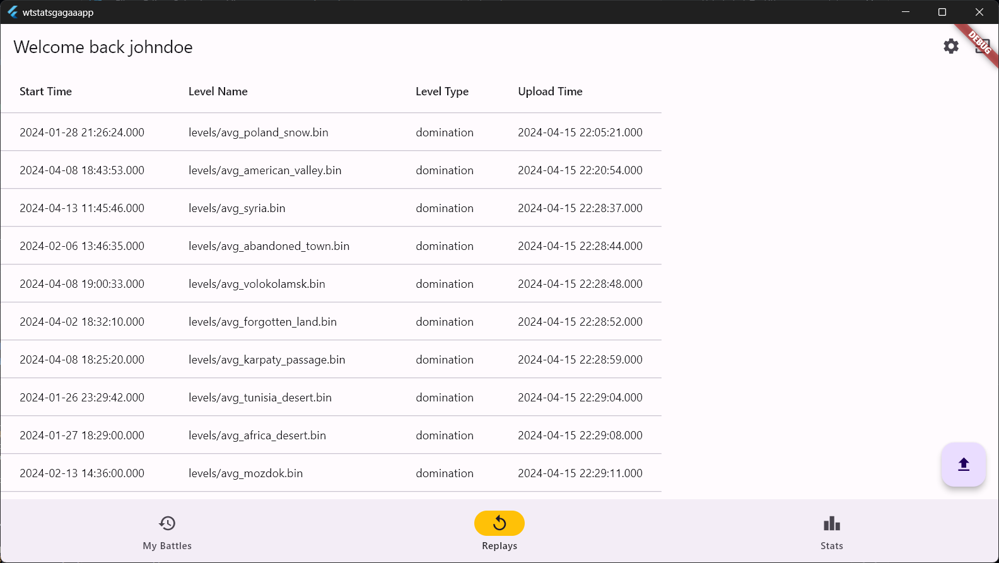
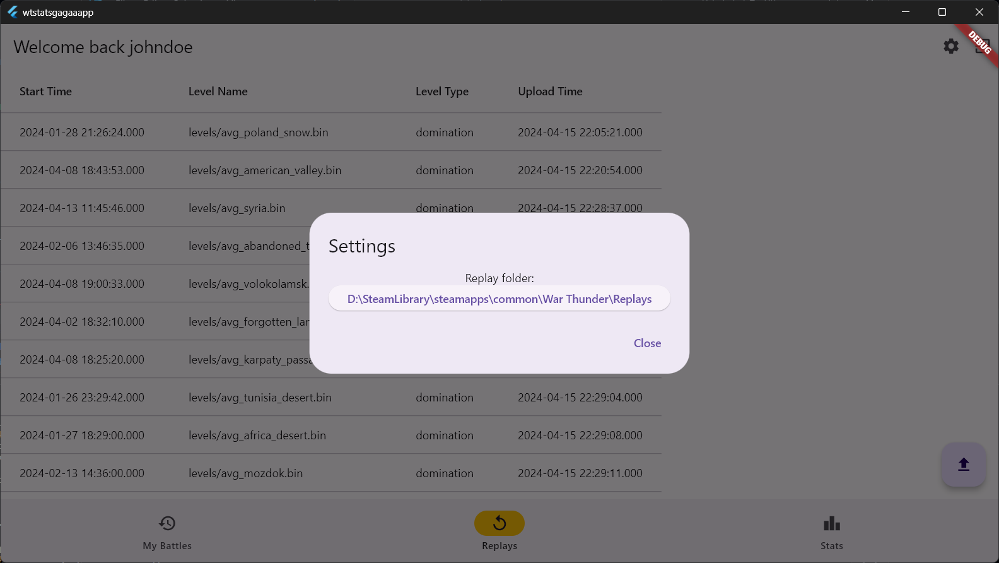
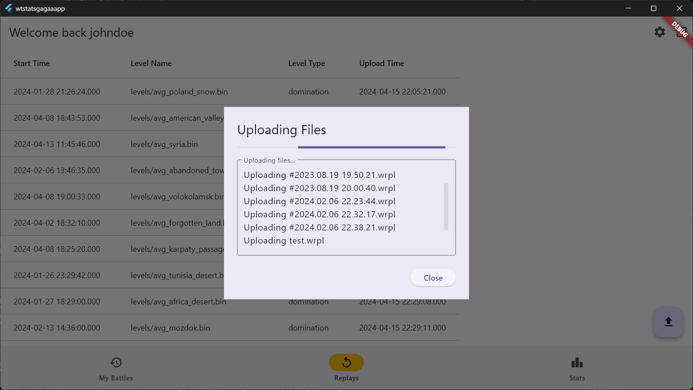

# WT-Replays-Saver

WT-Replays-Saver is a free application designed to help you save and review your battle results. With this tool, you can easily keep track of your performance and analyze your strategies.

## Key Features

### Uploaded Replays History

Keep a record of all your uploaded replays. This feature allows you to revisit your past battles, learn from your mistakes, and improve your strategies.

### Select Your Replays Folder

Easily select and manage your replays folder. This feature provides a user-friendly interface to organize your battle replays.

### Automatic Replay Uploads

Automate the process of uploading your replays. This feature ensures that all your battle results are saved and ready for review.

## Demo Video

## Getting Started

To get started with WT-Replays-Saver, download the latest release, select your replays folder, and let the app do the rest. Happy battling!
